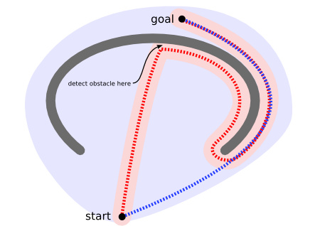

## 寻路算法

寻路不管是在现实世界亦或者是游戏制作行业，都非常重要。

考虑如下图展示的情形，寻路是一件动态的、复杂的事情。图中在起点到终点之间有一道围墙，这道围墙很可能就是对寻路算法设下的”陷阱“，实现糟糕的寻路可能不得不遍历完整个半包围区域才能发觉目标点并不在里面。所以往往我们会希望寻路算法会有”远见“能力，这样就能即快又准确地找到一条通往目的地的路径。



寻路算法都是强烈依赖于地图的，地图的抽象化好坏直接可以决定寻路算法的实现结果优劣，下面介绍下```地图表示```的几种方式。