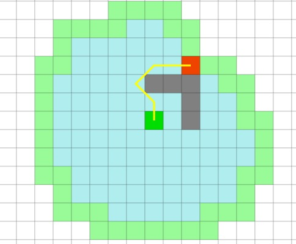
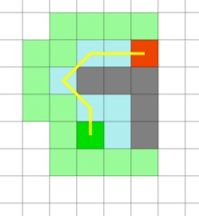
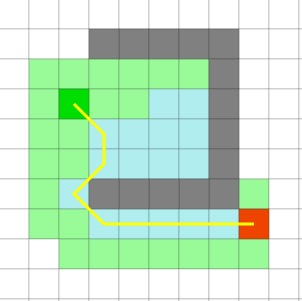
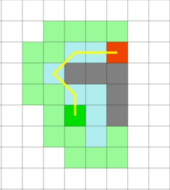
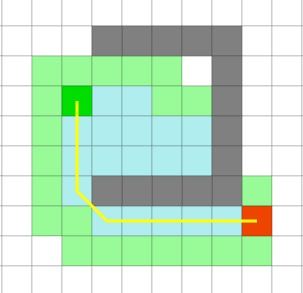

## 寻路算法的几种实现

寻路算法本身是一个统称，具体的实现有```Dijkstra```、```BSF```、```A*```等。

#### Dijkstra算法

```Dijkstra```算法简单说来，就是从起始点访问其他临近节点，并将该节点加入待检查节点集合中，使用松弛算法更新待检查节点的路径长度值。



#### 最好优先搜索(best-first search)

```BFS```，又称为”贪心最好优先搜索”，该算法与```Dijkstra```类似，也会从起始节点开始把临近节点逐个加入到待检查列表中，不过```BFS```多了一个从当前节点到目标节点距离的估计值（启发值）。

该算法并不在待检查节点集合中选取距离起始点近的节点进行下一步的计算，而是选择距离目标点近的节点。贪心最好优先搜索算法并不能保证寻找到最优路径，然而却能大大提高寻路速度，因为它使用了启发式方法引导了路径的走向。举例来说，如果目标节点在起始点的南方，那么贪心最好优先搜索算法会将注意力集中在向南的路径上。



从以上两站图对比来看，好像```BFS```比```Dijkstra```优秀不少，但是其实贪心算法往往追求的是快速寻路，在计算花费上可能会付出更多的代价，而```Dijkstra```虽然会需要遍历更多的节点，但是会得到最短路径。

再看如下所示的两张图，如果障碍物的位置并不是非常适合贪心算法的话，可能贪心算法就需要走一些弯路来达到目的地。

Dijkstra:


BFS:



#### A*算法

```A*```是目前最流行的寻路算法，因为它十分灵活，能够被应用于各种需要寻路的场景中。

与```Dijkstra```算法相似的是，```A*```算法也能保证找到最短路径。同时```A*```算法也像贪心最好优先搜索算法一样，使用一种启发值对算法进行引导。在刚才的简单寻路问题中，它能够像贪心最好优先搜索算法一样快：



而在后面的具有凹陷障碍物的地图中，```A*```算法也能够找到与```Dijkstra```算法所找到的相同的最短路径。



下面将主要讨论```A*```算法的逻辑并且实现一个简要的demo。