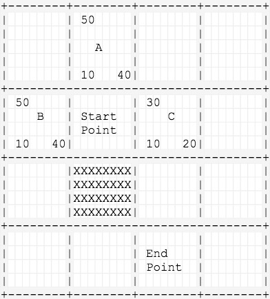
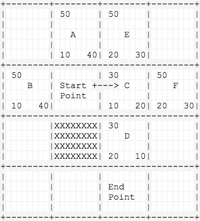
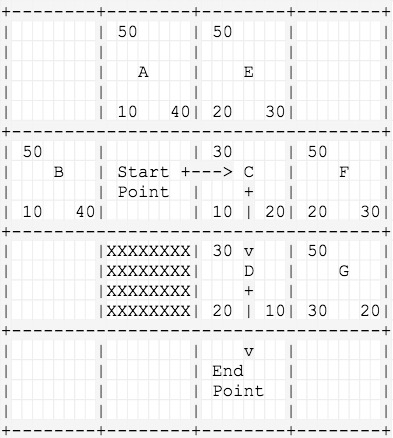
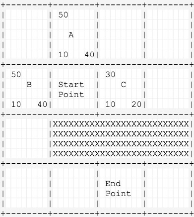
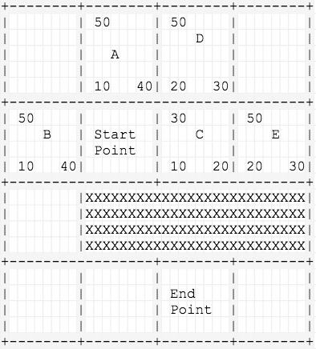
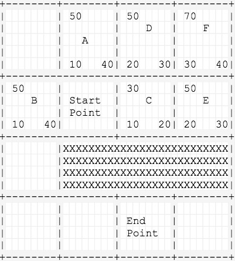
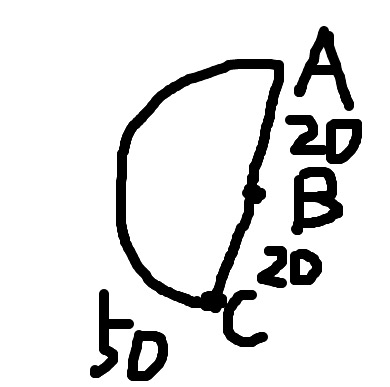
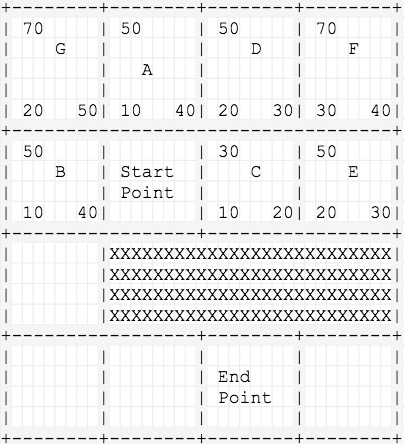
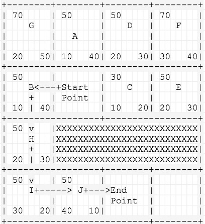

## 算法配图拆解

#### 先来个简单点的例子

前面已经介绍了一些```A*```算法的概念，下面通过一个小例子按步骤拆解下每步所做的事情。

##### 第一步

    1.将起点Start Point放入开启列表
    2.从开放列表取出一个点作为当前节点，将当前节点放入关闭列表
    3.遍历当前节点的所有临近节点A、B、C，计算三个节点的F、G、H三个值，将A、B、C三个节点的父节点记为Start Point，放入开启列表（本次不考虑斜对角）
    PS.H的计算采用的是曼哈顿距离



##### 第二步

    4.从开启列表中弹出一个F值最低的节点：C（记得之前介绍的，A*算法将每次检测具有最小F值的节点），放入关闭列表
    5.找到C的所有临近节点：D、E、F，其中Start Point已经在关闭列表，因此不考虑
    6.D、E、F的G值计算：G = current.g + g(n) = 10 + 10 = 20，将D、E、F三个节点的父节点标记为C并且放入开启列表



##### 第三步

    7.从开启列表中弹出一个F值最低的节点：D，放入关闭列表
    8.在D的临近节点中发现了终点，循环结束，按节点的parent返回追溯节点链，即为寻路路径




#### 再来一个稍微绕路的

之前那张图上只有一个障碍物，只需要三步就发现了终点，比较顺利，这次的图会利用启发式函数的取值制造一个小陷阱。如图所示，C点下面是障碍物，无法继续向下走的，势必只能从起点向左绕路走。下面来看下```A*```是怎么绕路的。



##### 第一步

    1.还是取出F值最小的C点，将其周围节点放入开启列表，分别是D点和E点
    2.将这两个点的F、G、H三个值计算出来，父节点标记为C点，C点放入关闭列表



##### 第二步

    3.从开启列表取出一个F值最小的点，但是这时候可以看到，F值最低的为50的点有四个，随便去一个好了，那么就取E点
    4.找出E的临近节点F点，计算出F、G、H值标记父节点为E点，E点放入关闭列表，F点放入开启列表，开启列表不为空 & 没找到终点，循环继续



##### 第三步

    5.可以继续看上一张图，取F值最小的点，就取D点好了，扫描发现D的临近节点A点、F点已经在开启列表了，C点已经在关闭列表
    6.此时，对于已经在开启列表的临近节点A点和F点，计算g = D.G + g(D->A)/g(D->F) = 20 + 10 =30，判断变量g是否小于A.G或者F.G
    PS.对于已经在开启列表中的临近节点进行G值判断是很重要的一件事，我们用下面的灵魂画作来说明下。



    图上A、B、C三个点，从A点开始临近节点时B点和C点，g(A->C) = 50，g(A->B) = 20，g(B->C) = 20
    此时从开启列表取出B点，发现B的临近节点C已经在开启列表中了，但是g = B.G + g(B->C) = 20 + 20 =40 < C.G
    因此我们会把C的parent指向B点而不是A点，表示从A点过B点到C点的代价更低。
    根据G值调整父节点指向是```A*```两个关键步骤之一
    另一个关键步骤是：每次从开启列表都弹出一个F值最小的节点，这个步骤就确保了，每次都去尝试移动距离最低的点。
    我之前在看```A*```的时候的自我总结：
    G用来调整节点的选择，H用来确保始终朝向相对优的方向前进，F就是一个综合策略值，保证能够得出一个相对最优解。

##### 第四步

    7.从开启列表取出A点，A点的临近节点只有G点了，计算G点的F、G、H值，标记父节点为A点，A点放入关闭列表



##### 第五步

    8.现在开启列表中F值最小的就是B点了，我们可以看到其实兜了一圈还是最终找到了这个正确的节点
    9.从B点开始看临近节点，H、I、J三个节点的F值都是50，所以从开启列表中会依次弹出这三个节点，直到在J点的临近节点找到终点
    10.我们可以看到，在绕过了刚开始的一段弯路之后，其实从B点开始寻找的路径就非常快乐，这是H值发挥了作用
    11.最后一步就是在发现了终点后，反向查询节点的父节点，就能得到寻路路径了


