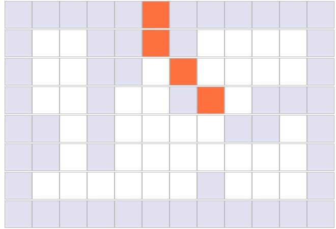
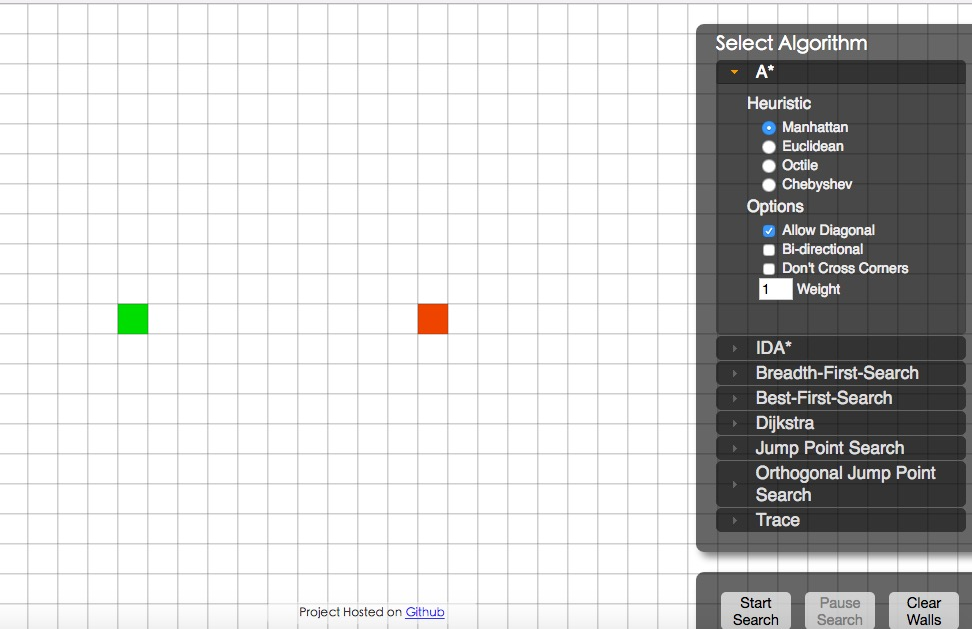

## Demo Show


1.基于前面的1.0版本的```A*```写了一个简陋的可视化[demo](http://localhost:8001/)，可以给大家看下。



2.```github```上有不少实现的寻路算法可视化界面，不仅实现了```A*```，还实现了其他的几种算法，如[这个](http://qiao.github.io/PathFinding.js/visual/)

