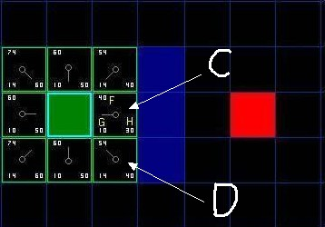

## A*算法介绍

如之前所介绍的，```A*```似乎比```Dijkstra```和```BFS```都更快更好，其秘诀在于它结合了```Dijkstra```算法使用的节点信息（倾向于距离起点较近的节点），以及贪心最好优先搜索算法的信息（倾向于距离目标较近的节点）。

#### 概念与名词解释

##### 临近节点与开启列表，关闭列表


图中绿色节点是起始节点，周围的八个节点就是临近节点；```A*```算法会维护一个**开启列表**，算法的主体逻辑就是遍历开启列表，每次从开启列表中取出一个节点（开启列表的第一个节点当然就是起点），计算当前节点的临近节点并根据条件（如果临近节点是障碍物或者已经遍历过或者已经在开启列表中待遍历，就不会放入）放入开启列表中，然后把当前这个节点放入**关闭列表**，表示已经遍历过。

当然临近节点也可以只是上下左右的四个节点，不允许走斜对角。这里面有个概念需要普及：**从起始点水平/垂直地步进一格与斜对角步进一格，两者的cost是不同的，一般而言会认为斜对角的步进cost大于水平/垂直步进一格但是小于两格。**比如我们如果认为水平/垂直方向步进一格的代价是10，那么就可以认为斜对角步进一格的代价是14。这是“代价”是一个必需的计算，因为步进代价其实就是一种期望路径朝哪个方向行进的依据之一。

##### F,G,H

在上面提到了步进的代价，一般地，我们使用```g(n)```来表示从起点到任意节点n的路径花费，```h(n)```表示从节点n到目标节点路径花费的估计值（启发值）。

```A*```算法在物体移动的同时平衡这两者的值。定义```f(n)=g(n)+h(n)```（请牢记这个公式，因为```A*```算法的核心就是这个公式），```A*```算法将每次检测具有最小```f(n)```值的节点。



如图所示，起点是绿色的节点，终点是红色的节点。起点附近的8个临近节点每个格子都标上了三个数字，分别是左上角的F，左下角的G，右下角的H。查看C点，G=10，表示从起点到C点的移动代价是10，H=30（这个H值后面会说怎么算出来的）表示从C点到终点的距离启发值是30，那么F=G+H就是40。D点是起点的斜对角点，G=14，相对来说从起点走一步，到C比到D的花费更少，但是D点的H=40，计算下来的F值是54。

H是怎么计算出来的？我们一般会把H的计算公式称为启发式函数，计算H的方式有很多种，图示中所使用的计算公式叫做**```曼哈顿距离(Manhattan distance)```**。

##### 网格地图中的启发式函数

###### 曼哈顿距离(Manhattan distance)

对于方形网格，标准的启发式函数就是[曼哈顿距离](http://en.wikipedia.org/wiki/Taxicab_geometry)。考虑一下你的代价函数并确定从一个位置移动到相邻位置的最小代价D。在简单的情况下，你可以将D设为1。在一个可以向4个方向移动的方向网格中，启发式函数是曼哈顿距离的D倍:

    function Manhattan(node, goal, D) {
        var dx = abs(node.x - goal.x);
        var dy = abs(node.y - goal.y);
        return D * (dx + dy);
    }

可以看到曼哈顿距离就是x,y坐标的距离绝对值乘以一个考量值D，在示例中我们移动一格的G值为10，那么这里的D就是10，这么做的目的是为了将G和H的单位统一。

###### 对角线距离

如果允许在地图中沿着对角线移动，那么就需要一个不同的启发式函数:对角线距离函数（有时被称为[契比雪夫距离(Chebyshev distance)](http://en.wikipedia.org/wiki/Chebyshev_distance)）。

下面这个函数用于处理对角线，假设直线和对角线的移动代价都是D:


    function heuristic(node, goal, D) {
        var dx = abs(node.x - goal.x);
        var dy = abs(node.y - goal.y);
        return D * max(dx, dy);
    }

如果沿对角线移动的代价并不是D，而是类似于D^2 = sqrt(2)*D，就像我们的示例中一样，直线是10(D)，二斜对角我们会考虑为14(D2)，那么上面的启发式函数并不适合。这里有一个更复杂而准确的函数：

    function heuristic(node, goal, D, D2) {
        var dx = abs(node.x - goal.x);
        var dy = abs(node.y - goal.y);
        return D * (dx + dy) + (D2 - 2 * D) * min(dx, dy);
    }

在这里，我们计算不走对角线所需要的步数，然后减去走对角线节约的步数。在对角线上的步数有min(dx, dy)个，其每步的代价为D^2，可以节约2*D的非对角线步数的代价。

在这里介绍的只是最简单的情况：网格地图中的最简单的三种启发式函数，基本可以看做是```hello world```级别的，因为现实情况远比计算直线、对角线行走复杂得多，往往在使用```A*```算法时该如何依据实际情况构建合适的启发式函数是一个重要环节。
