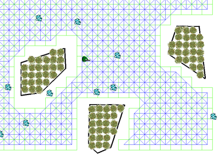
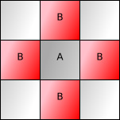
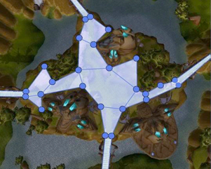

## 地图表示

地图表示就是指将现实的复杂地图抽象化为数学意义上的”图“，以便于算法的计算。

#### 网格（Grid）

网格图将世界（world）均匀分割为小的规则图形，这些图形有时被称为“图块（tile）”。常用的网格有正方形、三角形和六边形。网格很简单，也很容易了解，很多游戏都采用它来表示世界。

将不规律的地图”网格化“后，就可以在网格中的每个格子上标明可以移动的路径以及不能够通过的障碍物。



##### 图块移动（Tile movement）



即使在网格中，也可以选择沿图块、边（Edge movement）或顶点移动（Vertex movement）。图块是默认选项，尤其是角色单元只能移动到图块中心的那些游戏。在上图中，在A处的单元可以移到所有标B的位置。你也许还允许对角线移动，代价相同或者更高。本次分享也主要采取块移动作为演示。

#### 导航网（Navigation Meshes）

以上是地图离散化的一种方式：```网格(grid)```，还有其他的方法如```导航网络(navigation mesh)```，这种路径生成方法是将地图离散化成很多形状的多边形，著名游戏魔兽世界就是采用了这种方法划分地图的。



#### 其他

其他还有许多地图的表达方式，如：多边形移动（Polygon movement）、环绕式地图（Wraparound maps）等，在此不再展开了。

在不同的情况下需要采用不同的方法来实现，因此往往寻路都不存在着”最优解“，而追求的是”最合适“的解。


#### 看个例子

可以看下[这个仓库](https://github.com/kimmykuang/GameShenMo)，里面的前端就是使用了网格化的地图来表达路径信息的。